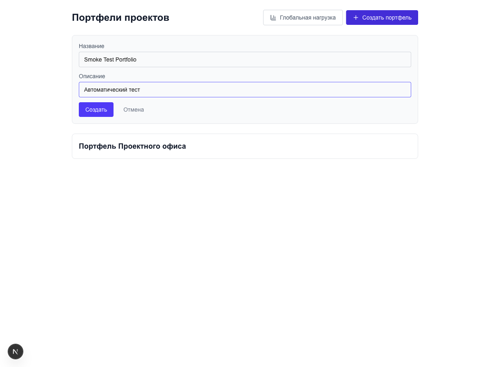
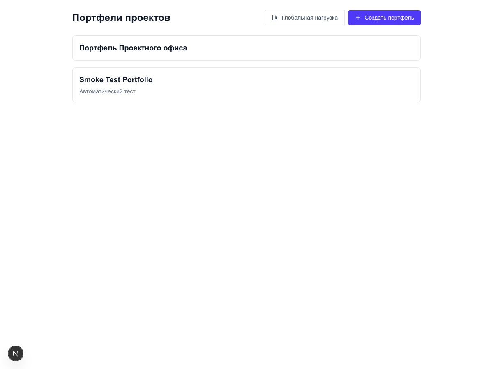
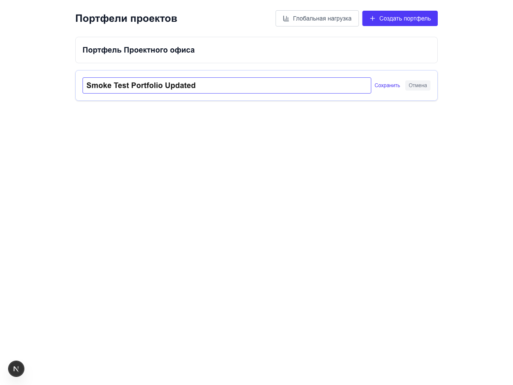
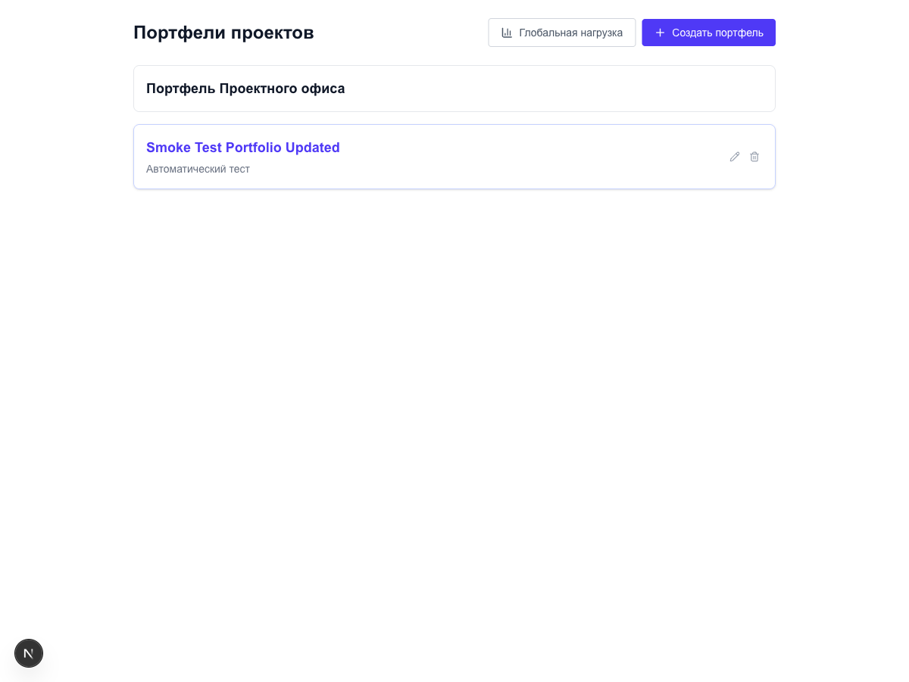
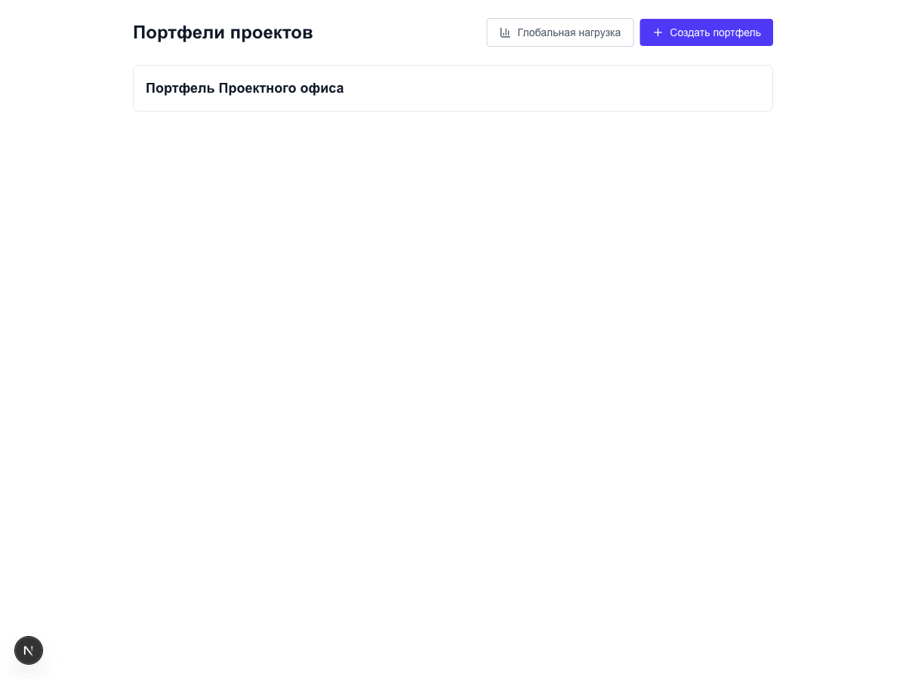

# Smoke-тест: Создание, изменение и удаление портфеля

**Дата:** 2026-04-19
**Инструмент:** playwright-mcp
**Статус:** Завершён

---

## Описание задачи

Сценарное UI-тестирование основных операций с портфелями: создание нового портфеля, редактирование существующего и удаление. Тестирование проводилось на странице `/portfolios`.

---

## Сценарий 1: Создание портфеля

1. Открыта страница `/portfolios`

   

2. Нажата кнопка "+ Создать портфель" — форма открылась

3. Введено название "Smoke Test Portfolio" и описание "Автоматический тест"

   

4. Нажата кнопка "Создать"

5. Портфель появился в списке

   

---

## Сценарий 2: Изменение портфеля

1. Открыта страница `/portfolios`; выполнен hover на карточку, нажата иконка редактирования (карандаш) — форма открылась

   

2. Изменено название на "Smoke Test Portfolio Updated"

3. Нажата кнопка сохранения

4. Новое название отображается в списке

   

---

## Сценарий 3: Удаление портфеля

1. Выполнен hover на карточку портфеля

   

2. Нажата иконка удаления (без диалога подтверждения)

3. Портфель удалён из списка

   

---

## Итоговая таблица результатов

| Сценарий             | Результат  |
|----------------------|------------|
| Создание портфеля    | Успешно    |
| Изменение портфеля   | Успешно    |
| Удаление портфеля    | Успешно    |

---

## Наблюдения

- **Клиентская валидация работает корректно:** кнопка "Создать" остаётся disabled пока поле названия пустое.
- **Удаление без подтверждения** — потенциальная UX-проблема. Отсутствие диалога подтверждения создаёт риск случайного удаления портфеля. Рекомендуется добавить модальный диалог с подтверждением действия.

---

## Общий вывод

Все три основных сценария работы с портфелями — создание, редактирование и удаление — выполнены успешно. Критических блокирующих проблем не обнаружено. Выявлен один UX-риск: удаление производится без подтверждения, что может привести к случайной потере данных. Рекомендуется устранить до релиза.
