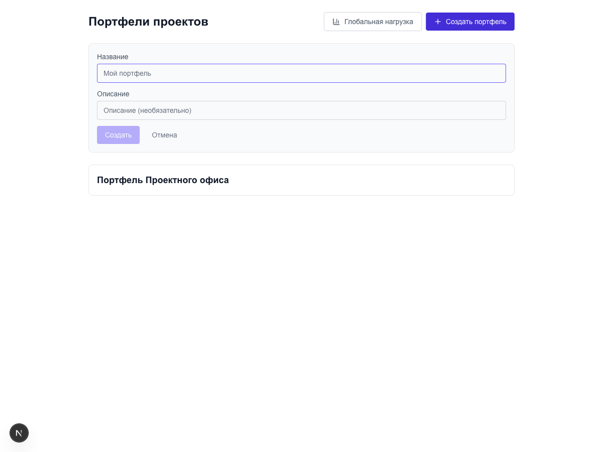
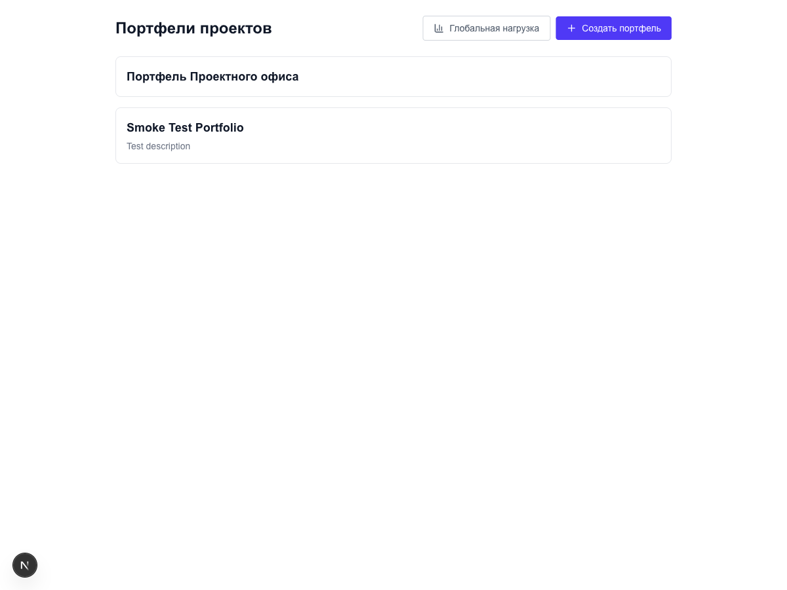
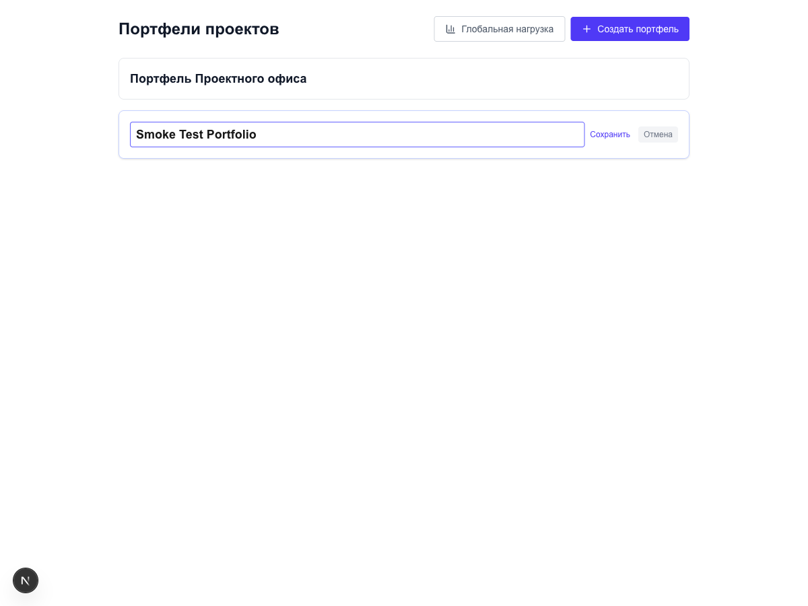
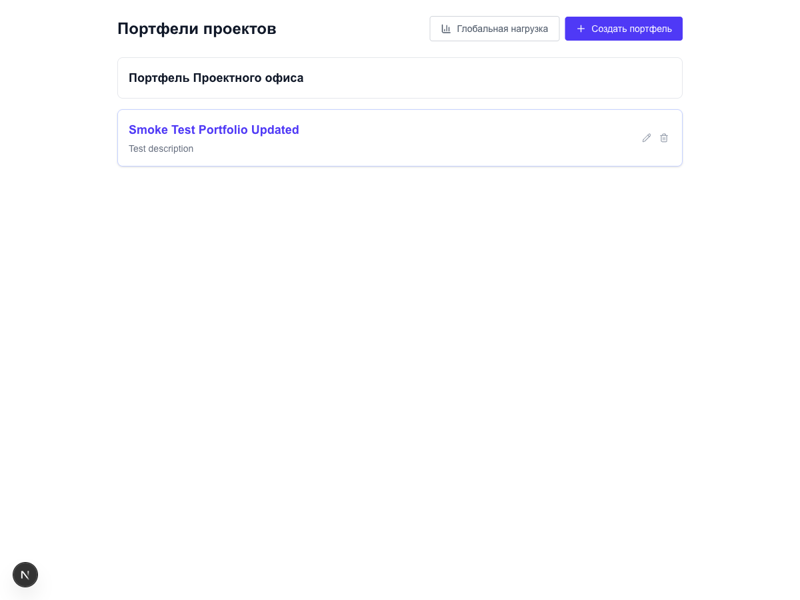

# Smoke-тест: CRUD портфелей проектов

**Дата**: 2026-04-16
**URL**: http://localhost:3000/portfolios
**Контекст**: Smoke-тестирование сценария CRUD портфелей проектов

---

## Выполненные шаги

### Часть 1: Создание портфеля

**Шаг 1.1 — Открыть страницу**
Страница загружена, виден список с одним портфелем, кнопка "Создать портфель" доступна.

**Шаг 1.2 — Нажать кнопку создания**
Форма появилась с полями "Название" и "Описание", кнопками "Создать" и "Отмена".

**Шаг 1.3 — Ввести название**
Введено "Smoke Test Portfolio".

**Шаг 1.4 — Ввести описание**
Введено "Test description".

**Шаг 1.5 — Нажать "Создать"**
Форма закрылась, карточка появилась в списке.

---

### Часть 2: Редактирование

**Шаг 2.1 — Найти карточку**
Карточка "Smoke Test Portfolio" найдена.

**Шаг 2.2 — Нажать карандаш**
Inline-редактирование активировалось.

**Шаг 2.3 — Ввести новое название**
Введено "Smoke Test Portfolio Updated".

**Шаг 2.4 — Нажать "Сохранить"**
Карточка обновила название.

---

### Часть 3: Удаление

**Шаг 3.1 — Найти карточку**
Карточка "Smoke Test Portfolio Updated" найдена.

**Шаг 3.2 — Нажать корзину**
Удаление выполнено без диалога подтверждения.

**Шаг 3.3 — Проверить исчезновение**
Карточка исчезла, список вернулся к исходному состоянию.

---

## Результаты тестирования

| Шаг | Описание | Результат |
|-----|----------|-----------|
| 1.1 | Открыть страницу портфелей | ✅ Успешно |
| 1.2 | Нажать кнопку создания | ✅ Успешно |
| 1.3 | Ввести название портфеля | ✅ Успешно |
| 1.4 | Ввести описание портфеля | ✅ Успешно |
| 1.5 | Подтвердить создание | ✅ Успешно |
| 2.1 | Найти созданную карточку | ✅ Успешно |
| 2.2 | Активировать inline-редактирование | ✅ Успешно |
| 2.3 | Ввести новое название | ✅ Успешно |
| 2.4 | Сохранить изменения | ✅ Успешно |
| 3.1 | Найти карточку для удаления | ✅ Успешно |
| 3.2 | Нажать кнопку удаления | ✅ Успешно |
| 3.3 | Проверить исчезновение карточки | ✅ Успешно |

**Итого**: 12 / 12 шагов пройдено успешно.

---

## Наблюдения / замечания

> ⚠️ **Удаление без подтверждения** — при нажатии на кнопку корзины портфель удаляется мгновенно, без диалога подтверждения. Это создаёт риск случайного удаления данных пользователем. Рекомендуется добавить модальное окно подтверждения перед выполнением деструктивного действия.

---

## Вывод

Все 12 шагов сценария CRUD портфелей пройдены успешно: создание, редактирование и удаление работают корректно. Единственное замечание — отсутствие диалога подтверждения при удалении портфеля, что является потенциальным UX-риском. Рекомендуется устранить это замечание до выхода в продакшн.
